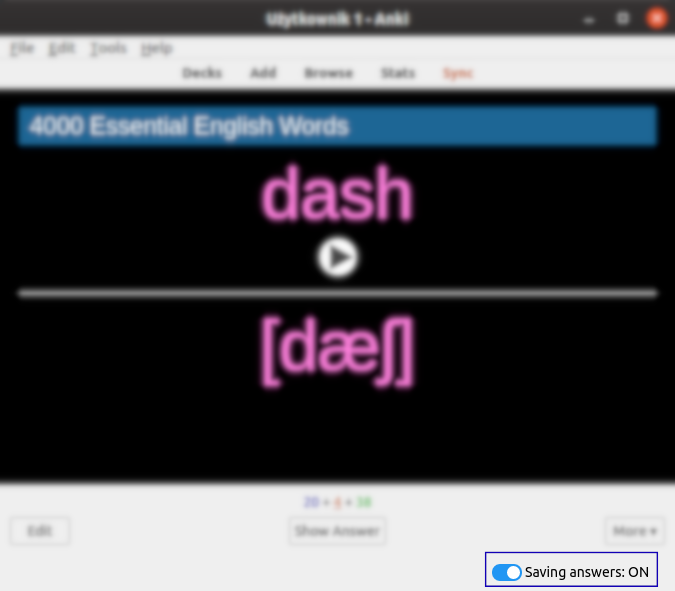
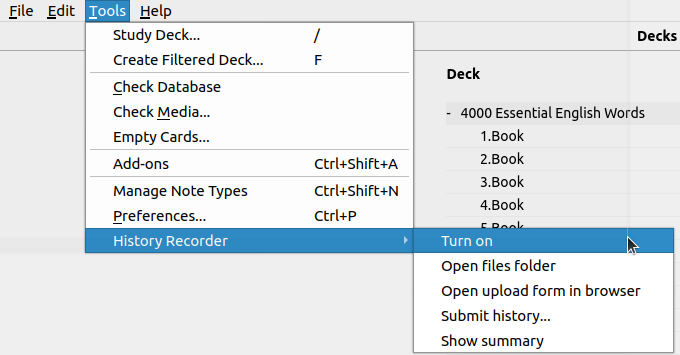
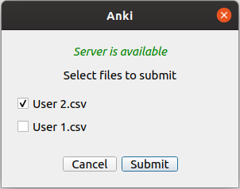
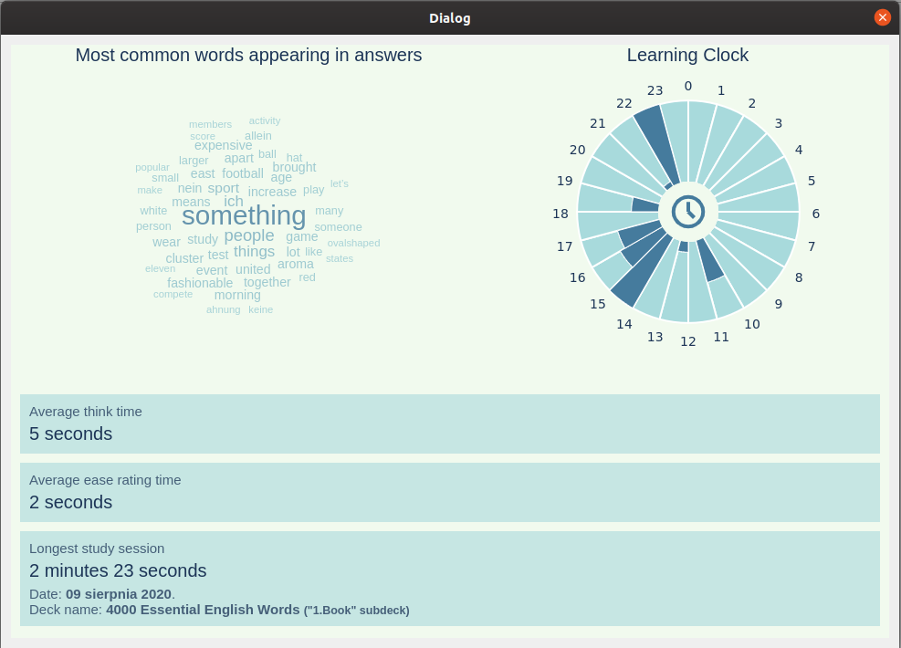
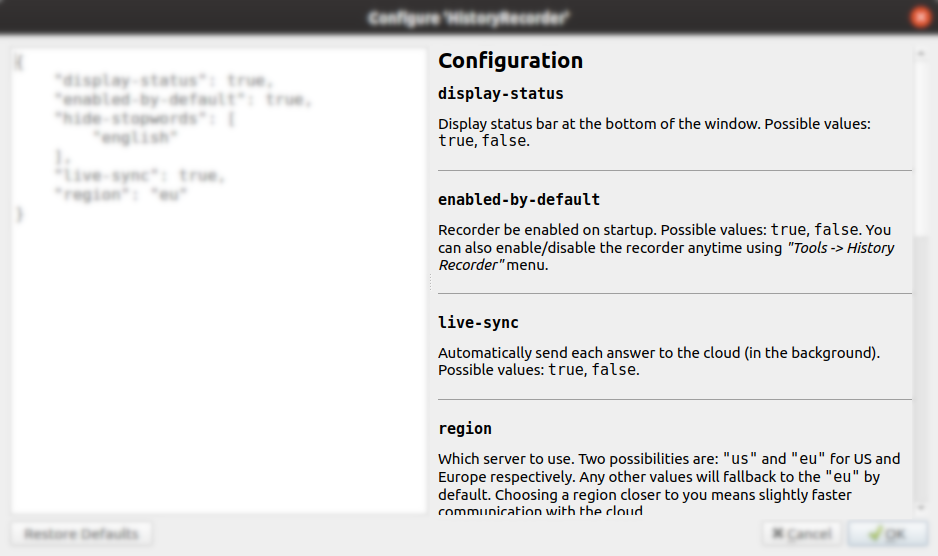

# History Recorder add-on user manual

1. [Overview](#overview)
2. [Quickstart](#quickstart)
3. [Installation](#installation)
    1. [From Anki Web](#via-anki-addon-manager-from-anki-web)
    2. [Adding files manually](#add-files-manually)
4. [Features & usage](#features--usage)
    1. [Collecting data in the background](#collecting-data-in-the-background)
    2. [Enable/disable saving answers](#enabledisable-saving-answers)
    3. [Open data file](#open-data-file)
    4. [Upload data file to the cloud](#upload-data-file-to-the-cloud)
    5. [Simple summary of your answers](#simple-summary-of-your-answers)
5. [Configuration](#configuration)
6. [Known bugs & issues](#known-bugs--issues)
7. [Reporting a problem](#reporting-a-problem)

## Overview
**HistoryRecorder** is an Anki addon that collect various information and meta data
from learning process. Collected data is a source of information about how a user performed on specific cards. 
The aim of the addon is to gather enough data for a machine learning process and for creating a neural network 
that would be able to estimate intervals based on user performance and card specification. The addon works 
in the background and do not affect learning process.

**HistoryRecorder** addon is a part of a research made for a master thesis, which focus on running a machine learning process mentioned above.

## Quickstart
It's very easy to start using HistoryRecorder.
1. First, install an addon via Anki Addon Manager using this code: [1011000875](https://ankiweb.net/shared/info/1011000875)
2. Restart Anki if prompted to do so. 
2. Voilà! HistoryRecorder is already set up, enabled and configured. 
All you have to do is to answer some cards and learn new things :) **Thanks for your contribution to my research!** 

More advanced use of the addon is described below. 

## Installation

---
**NOTE**

The addon requires Anki version **2.1.22 or later**

---

The are 2 ways of adding the addon:
##### Via Anki Addon Manager from Anki Web. 
1. Open the Install Add-on dialog by selecting `Tools` | `Add-ons` | `Browse & Install` in Anki.
2. Input [1011000875](https://ankiweb.net/shared/info/1011000875) into the text box labeled `Code` and press the `OK` button to proceed.
3. Restart Anki when prompted to do so in order to complete the installation of HistoryRecorder

##### Add files manually.
If for any reason you can't use AnkiWeb, you can add addon files manually.
1. Download [this repository](https://github.com/de-nuke/anki-history-recorder/archive/master.zip)
2. Unpack zip file. You will find a folder called `HistoryRecorder` inside. 
3. Copy/move this directory into Anki's addons directory. You can open addons 
directory via Anki. Go to `Tools` | `Add-ons` | `View files` - directory should open. You can also open it manually in explorer.
    * For Ubuntu: `~/.local/share/Anki2/addons21`
    * For Windows: `%appdata%/Anki2/addons21`
    * For Mac: `~/Library/Application Support/Anki2/addons21`
    
## Features & usage
HistoryRecorder's main feature is to collect data in the background, but it comes 
with a few more features that let you control it. This section describe all features of the addon and describe the usage of it.

#### Collecting data in the background
This is the main feature of the addon. Whenever you answer a card and rate its ease, HistoryRecorder 
performs a few actions to fetch information about the answering process. All data that was retrieved create *a record*.
*The record* is then saved in a file and automatically send to the cloud. 
*The record* consists of various information, for example: timestamp of the answer, deck name, card question and answer, time taken to answer, etc.
You can find a detailed description of what data is collected in a [Collected Data description](https://github.com/de-nuke/anki-history-recorder/blob/master/Collected%20data.md) 
 
This process is enabled by default and runs automatically. It doesn't require any user interaction. However, to 
be explicit and to let you know that addon is working, you will see an indicator in the bottom bar. Whenever the record is send to the cloud, 
you will see a pulsing *"saving..."* massage:

You can disable this indicator [in a config](#display-status)
 
  
#### Enable/disable saving answers
After installing the addon, it is enabled by default. It means that it will save every answer. 
If, for any reason, you don't want to save some answers (for a private deck or something) you can easily turn on/off the addon
with just one click. 

If you open a reviewer, you will see an indicator in the bottom bar:

You can enable and disable saving answers at any time by clicking on that switch. 
When addon is disabled, the switch and text will turn to gray and text will change to "Saving answers: OFF":

If you have this indicator [hidden](#display-status), you can still enable/disable the addon using menu action:

`Tools` | `HistoryRecorder` | `Turn on/off`

#### Open data file
Records are saved in a CSV file, separate for each user. The file can be found in
a `user_files` directory in the addon directory. To open this directory from Anki, 
click `Tools` | `History Recorder` | `Open files folder` menu action.

#### Upload data file to the cloud
You can upload generated data file to the cloud. Your records will increase the amount of data the machine learning will be run on therefore 
improving its performance. This is not required if [live-sync is enabled](#live-sync) and if you have an Internet connection working, because 
your records are automatically submitted. If you have [live-sync disabled](#live-sync) or you were offline, then uploading a file is the only way to send saved records. 
 
You have two ways of uploading a file.

1.  First one is to open a webpage prepared specifically for this purpose:
    * [history-recorder-storage-eu.herokuapp.com](https://history-recorder-storage-eu.herokuapp.com) or...
    * [history-recorder-storage-us.herokuapp.com](https://history-recorder-storage-eu.herokuapp.com)

    You will see a simple form to upload a file. You can open the webpage using
`Tools` | `History Recorder` | `Open upload form in browser` menu action.

2. Second way of uploading a file is to send it directly from the addon. Go to `Tools` | `History Recorder` | `Submit history`
action to open a dialog window:

    

    Select files you want to upload and click `Submit` button. You should see a progress bar and a status for each sent file. 

#### Simple summary of your answers

Collected data can be used to prepare a simple summary of your learning process. You can check
which words are the most common in the answers, at what time in a day you answer the most cards or 
when was the longest study session.

Click `Tools` | `History recorder` | `Show summary` action to open a windows with those stats. 
If you have some records already saved in a file, you should see such a window:
 

Word cloud generated for answers do not take stopwords (ex. "a", "an", "the", etc) into 
account by default. You can [change it in a configuration](#hide-stopwords).

## Configuration
You can configure the addon to better fit your preferences. You can do via `Tools` | `Add-ons` | `Config` window. 
If you open a config for this addon, you will see an explanation of each config option in the right panel:

#### Configuration settings:

##### **`display-status`**

Display/hide status bar at the bottom of the window. Possible values: `true`, `false`.

---

##### **`enabled-by-default`** 

Recorder is enabled on startup - it means that whenever you open Anki, recorder will be enabled. If you prefer 
to have it disabled by default, set this option to `false`. 

Possible values: `true`, `false`. 
You can also enable/disable the recorder anytime using *"Tools -> History Recorder"* menu.

---

##### **`live-sync`**

Automatically send each answer to the cloud (in the background). Possible values: `true`, `false`.

---

##### **`region`**

Which server to use. Two possibilities are: `"us"` and `"eu"` for US and Europe respectively. Any other values will fallback to the `"eu"` by default.
Choosing a region closer to you means slightly faster communication with the cloud.

---

##### **`hide-stopwords`**

Do not display stopwords ("and", "the", "of", etc) in a word cloud in summary window.
This value can be `true`, `false`, or a `list` of string.

* If it's `false`, then stopwords are not skipped.
* If it's `true`, then stopwords from all supported languages are skipped.
* If it's a `list`, then each element should be a name of the language. Stopwords only from given languages will be skipped.

Following languages are supported (the list comes from [NLTK project](https://www.nltk.org/)):

* `arabic` 
* `azerbaijani` 
* `danish` 
* `dutch` 
* `english` 
* `finnish` 
* `german` 
* `greek` 
* `hungarian` 
* `nepali` 
* `french` 
* `italian` 
* `italian`
* `romanian`
* `indonesian`
* `portuguese`
* `swedish`
* `norwegian`
* `norwegian`
* `slovene`
* `russian`
* `tajik`
* `turkish`
* `spanish`

## Known bugs & issues
*There's nothing here yet...*
## Reporting a problem
If you have any problems or you spot a bug, you can send me an email ([sutm.testing@gmail.com](mailto:sutm.testing@gmail.com)), [start an issue on Github](https://github.com/de-nuke/anki-history-recorder/issues/new) or post your comment [in the Anki forum official thread](https://forums.ankiweb.net/t/history-recorder-support-page/2087)
